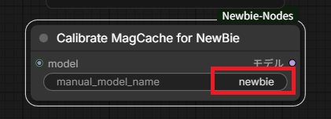
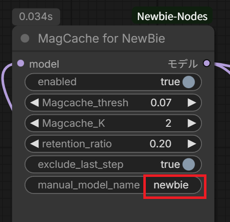

# ComfyUI-Newbie-Nodes (Experimental Fork)

This repository is an experimental fork of **NewBieAI-Lab/ComfyUI-Newbie-Nodes**.

The goal of this fork is to introduce experimental features (**FreeU**, **MagCache**), improve compatibility, and refine the XML prompt building logic for better tag handling.

---

## ⚠️ Disclaimer

This is an experimental version. Some behaviors (especially the XML output format) differ from the upstream repository. Use at your own risk.

---

## What’s different in this fork (high-level summary)

This section is intentionally written so the upstream author can quickly understand what changed.

### 1) New Features: FreeU & MagCache
- **NewBie FreeU-Like Patch (NewBieFreeULikeNode)**  
  A FreeU-like adjustment adapted for the NewBie (NextDiT) architecture.
- **MagCache System (MagCacheNewBie)**  
  A caching mechanism to accelerate inference by skipping computation for steps with small residuals, based on calibration data.

### 2) Modified: XML Prompt Builder Logic
- Distinguish between **“Tag style”** and **“Natural Language style”** prompts.
- Auto-underscore for standard tag inputs (e.g., `black hair` → `black_hair`).
- Shortened character name tag from `<name>` to `<n>`.
- Added `description_nl` (Natural Language) which is emitted as `<caption>` and preserves spaces.

### 3) Fixed: Flash Attention Compatibility
- Modified the loader logic to avoid Flash Attention usage so the nodes work in environments where `flash_attn` is missing or problematic.

---

## Installation

This is a fork repository, so it is **not** intended to be installed via ComfyUI Manager.
Please install by `git clone` only.

```bash
cd ComfyUI/custom_nodes
git clone https://github.com/Shiba-2-shiba/ComfyUI-Newbie-Nodes
```

Restart ComfyUI after installation.

---

## Node Overview

You will find these nodes under the **Newbie-Nodes** category in ComfyUI:

- **NewBieFreeULikeNode**: FreeU-like patch for the NewBie model
- **Calibrate MagCache for NewBie**: creates calibration data for MagCache
- **MagCache for NewBie**: uses calibration data to speed up inference
- **CharacterNode / GeneralTagBuilder**: updated XML prompt builder logic
- **NewBieCLIPLoader**: updated to avoid Flash Attention issues

---

## MagCache System (MagCacheNewBie)

MagCache is a caching mechanism to accelerate inference.

It works in two phases:
1. **Calibration**: measure the model’s behavior and store calibration data
2. **Inference**: apply caching during sampling based on that calibration data


### Quick start: bundled calibration (no calibration run needed)

This fork ships with a **pre-calibrated JSON** for the default example name `newbie`:

- `magcache_newbie_data/56247e707f880a5f.json`

That JSON was generated under the following conditions:

- Sampler: `res_multistep`
- Scheduler: `linear_quadratic`
- Steps: `30`
- `manual_model_name`: `newbie`

✅ If you use **the same sampler/scheduler/steps**, you can **skip the calibration node** and simply set
**`manual_model_name` = `newbie`** in **MagCache for NewBie** to use the bundled calibration.

If you change the sampler, scheduler, number of steps, or the model, create your own calibration (see below).

---
### Critical requirement: `manual_model_name` must match

MagCache uses calibration data to decide which steps can be skipped.  
The link key for that calibration data is **`manual_model_name`**.

✅ **If you run your own calibration**, you must enter the same `manual_model_name` string in BOTH:
- **Calibrate MagCache for NewBie** (calibration run)
- **MagCache for NewBie** (actual inference run)

If the name is missing or different, MagCache cannot find the correct calibration data and will not work as expected.

If you are using the **bundled `newbie` calibration** (Quick start above), you only need to set `manual_model_name` in **MagCache for NewBie**.

---

### Step 1) Calibrate
1. Add **Calibrate MagCache for NewBie** and connect your `model`.
2. In the red box field **`manual_model_name`**, type your model name (example: `newbie`).
3. Run once to generate calibration data.



---

### Step 2) Use MagCache (Inference)
1. Add **MagCache for NewBie** and connect the same `model`.
2. Set **`manual_model_name`** to the *exact same string* used in Step 1 (example: `newbie`).



---

### Notes / Tips
- If **`manual_model_name` is empty or mismatched**, MagCache will not be able to load the correct calibration.
- When using multiple NewBie models, use a different `manual_model_name` per model to avoid mixing calibration data.
- Start with the default parameters first. If you tune for speed, validate quality on a few prompts before using it broadly.
- If you significantly change your inference setup (e.g., switching to a different model), re-calibration is recommended.

---

## NewBie FreeU-Like Patch (NewBieFreeULikeNode)

This node applies a FreeU-like adjustment adapted for NewBie (NextDiT) to improve contrast and texture details.

Recommended workflow:
1. Apply the FreeU-like node before sampling (as designed in your graphs)
2. Compare outputs with and without FreeU on the same seed to judge the effect

---

## XML Prompt Builder Logic (fork behavior)

This fork changes the XML output behavior to better support tag-based workflows while preserving natural language.

### Tag inputs
- Intended for Danbooru-style tags
- Automatically converts spaces to underscores (e.g., `black hair` → `black_hair`)

### Natural language inputs
- `description_nl` is emitted as `<caption>` and preserves spaces for sentence-like prompts

### Output schema changes
- Character name tag shortened: `<name>` → `<n>`

---

## Credits

- Upstream: **NewBieAI-Lab/ComfyUI-Newbie-Nodes**
- This fork: **Shiba-2-shiba/ComfyUI-Newbie-Nodes**
